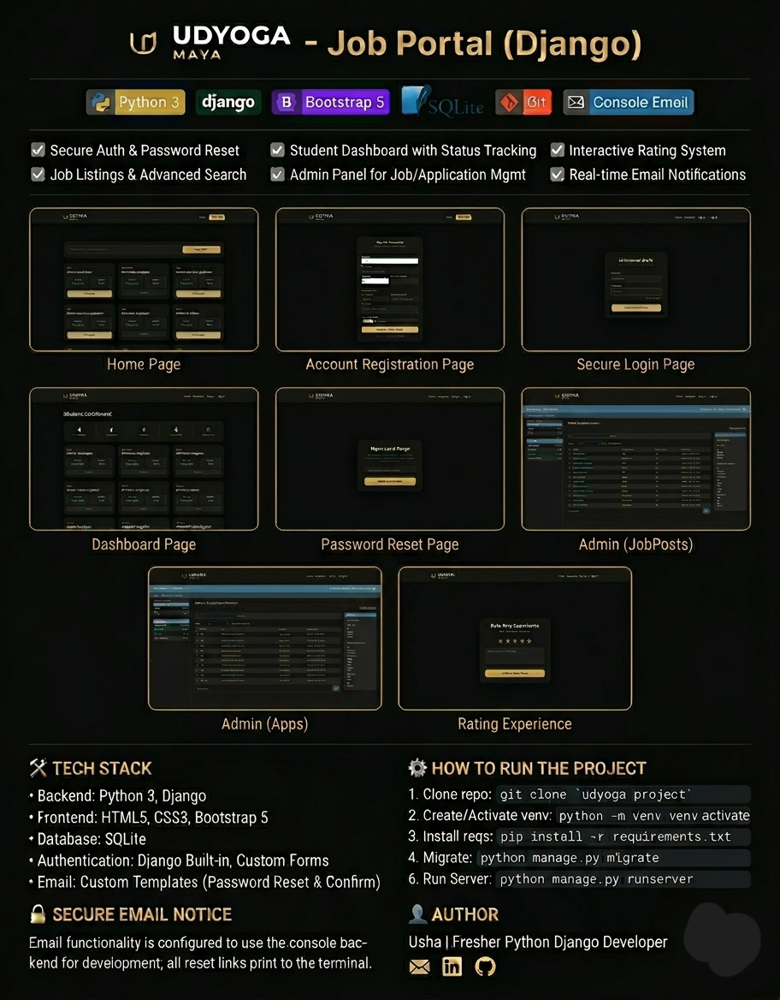

# UDYOGA MAYA - Job Portal (Django)

## About the Project
A comprehensive Job Portal built with Django, featuring secure authentication, student dashboards with status tracking, and an interactive rating system.

## Tech Stack
* **Backend:** Python 3, Django
* **Frontend:** HTML5, CSS3, Bootstrap 5
* **Database:** SQLite

## How to Run the Project
1. **Clone the repository:**
   `git clone https://github.com/kusha890/udyoga-job-portal.git`
2. **Create a virtual environment:**
   `python -m venv venv`
3. **Activate the virtual environment:**
   `venv\Scripts\activate`
4. **Install requirements:**
   `pip install -r requirements.txt`
5. **Run the server:**
   `python manage.py runserver`

## Key Features
* Secure Login and Account Registration
* Password Reset Functionality
* Student Dashboard with Application Status Tracking
## Author
* Usha
* Admin Panel for Job and Application Management
* Real-time Email Notifications (Console Backend)
